# 📋 DOCUMENTAÇÃO TÉCNICA - API BACKEND REQUIREMENTS

## 🎯 OBJETIVO
O APK Android precisa que o backend retorne dados de sessão de biometria no endpoint de pareamento de dispositivos.

---

## ❌ PROBLEMA ATUAL

O backend está retornando uma resposta **incompleta** no endpoint `POST /api/device/claim-sale`.

### Response ATUAL (incompleto):
```json
{
  "success": true,
  "message": "Device successfully paired to sale",
  "deviceId": "sale_1760296854514_7ni3wrefz4t",
  "saleId": "sale_1760296854514_7ni3wrefz4t",
  "immutableToken": "eyJhbGciOiJIUzI1NiIsInR5cCI6IkpXVCJ9..."
}
```

**Falta:** `biometrySessionId`, `storeId`, `customerCpf`

---

## ✅ SOLUÇÃO NECESSÁRIA

### Endpoint a Modificar:
```
POST https://cdccreditsmart.com/api/device/claim-sale
```

### Response CORRETO (completo):
```json
{
  "success": true,
  "message": "Device successfully paired to sale",
  "deviceId": "sale_1760296854514_7ni3wrefz4t",
  "saleId": "sale_1760296854514_7ni3wrefz4t",
  "immutableToken": "eyJhbGciOiJIUzI1NiIsInR5cCI6IkpXVCJ9...",
  
  "biometrySessionId": "bio_ses_1760296854514_abc123",
  "storeId": "550e8400-e29b-41d4-a716-446655440000",
  "customerCpf": "12345678900"
}
```

---

## 📝 CONTRATO DA API

### REQUEST (já funciona):

```http
POST /api/device/claim-sale
Content-Type: application/json
Accept: application/json
User-Agent: CDC-CreditSmart/1.0.0
```

**Body:**
```json
{
  "validationId": "9677e8fb-885c-40b2-8d7e-87997cadbda5",
  "hardwareImei": "353104903560533",
  "fingerprint": "700a6d70",
  "deviceInfo": {
    "model": "moto g15",
    "brand": "motorola",
    "androidVersion": "15",
    "apiLevel": 35,
    "serialNumber": null,
    "androidId": "abc123def456"
  }
}
```

### RESPONSE (precisa adicionar 3 campos):

```typescript
interface ClaimSaleResponse {
  success: boolean;
  message: string;
  deviceId: string;
  saleId: string;
  immutableToken: string;
  
  // ✅ ADICIONAR ESTES 3 CAMPOS:
  biometrySessionId: string;  // ID da sessão de biometria facial
  storeId: string;           // UUID da loja onde a venda foi criada
  customerCpf: string;       // CPF do cliente (11 dígitos)
}
```

---

## 🔧 IMPLEMENTAÇÃO BACKEND

### Exemplo Node.js/Express:

```javascript
app.post('/api/device/claim-sale', async (req, res) => {
  try {
    const { validationId, hardwareImei, fingerprint, deviceInfo } = req.body;
    
    // 1. Buscar venda pendente
    const sale = await Sale.findOne({ 
      validationId, 
      status: 'pending' 
    });
    
    if (!sale) {
      return res.status(404).json({ 
        error: 'Sale not found or expired' 
      });
    }
    
    // 2. Parear dispositivo com a venda
    const device = await Device.create({
      saleId: sale.id,
      imei: hardwareImei,
      fingerprint,
      model: deviceInfo.model,
      brand: deviceInfo.brand,
      androidVersion: deviceInfo.androidVersion
    });
    
    // 3. Criar sessão de biometria
    const biometrySession = await BiometrySession.create({
      saleId: sale.id,
      deviceId: device.id,
      customerId: sale.customerId,
      status: 'pending',
      expiresAt: Date.now() + (24 * 60 * 60 * 1000) // 24h
    });
    
    // 4. Gerar token imutável
    const immutableToken = jwt.sign(
      { deviceId: device.id, saleId: sale.id },
      process.env.JWT_SECRET,
      { expiresIn: '1y' }
    );
    
    // 5. Buscar dados do cliente
    const customer = await Customer.findById(sale.customerId);
    
    // ✅ 6. RETORNAR RESPONSE COMPLETO COM OS 3 CAMPOS ADICIONAIS:
    res.json({
      success: true,
      message: "Device successfully paired to sale",
      deviceId: device.id,
      saleId: sale.id,
      immutableToken: immutableToken,
      
      // ✅ CAMPOS OBRIGATÓRIOS PARA O APK:
      biometrySessionId: biometrySession.id,  // ID da sessão
      storeId: sale.storeId,                  // UUID da loja
      customerCpf: customer.cpf               // CPF do cliente
    });
    
  } catch (error) {
    console.error('Error claiming sale:', error);
    res.status(500).json({ 
      error: 'Failed to claim sale',
      message: error.message 
    });
  }
});
```

---

## 📊 CAMPOS OBRIGATÓRIOS

### 1. `biometrySessionId` (string)
- **Tipo:** String (UUID ou ID único)
- **Formato:** `"bio_ses_1760296854514_abc123"` ou UUID
- **Origem:** Gerado ao criar sessão de biometria
- **Uso APK:** Para enviar embeddings faciais no endpoint `/api/biometry/verify`

### 2. `storeId` (string)
- **Tipo:** String (UUID)
- **Formato:** `"550e8400-e29b-41d4-a716-446655440000"`
- **Origem:** ID da loja onde a venda foi criada
- **Uso APK:** Para gerar hash do documento e anti-fraude

### 3. `customerCpf` (string)
- **Tipo:** String (11 dígitos numéricos)
- **Formato:** `"12345678900"` (sem pontos/traços)
- **Origem:** CPF do cliente da venda
- **Uso APK:** Para gerar `documentHash = SHA256(customerCpf)` e detectar fraude

---

## 🔄 FLUXO COMPLETO

```mermaid
sequenceDiagram
    participant APK
    participant Backend
    participant BiometryDB

    APK->>Backend: POST /api/device/claim-sale
    Note over APK,Backend: validationId + IMEI + fingerprint
    
    Backend->>Backend: Buscar venda pendente
    Backend->>Backend: Parear dispositivo
    Backend->>BiometryDB: Criar sessão de biometria
    BiometryDB-->>Backend: biometrySessionId
    
    Backend-->>APK: Response com biometrySessionId + storeId + customerCpf
    
    APK->>APK: Salvar dados localmente
    APK->>APK: Capturar foto facial
    APK->>APK: Extrair embeddings (512-dim)
    APK->>APK: Gerar documentHash = SHA256(customerCpf)
    
    APK->>Backend: POST /api/biometry/verify
    Note over APK,Backend: biometrySessionId + embeddings + documentHash + storeId
    
    Backend->>Backend: Verificar se mesmo rosto existe com CPF diferente
    Backend-->>APK: Success ou Fraud detected
```



---

## 🧪 TESTE DE VALIDAÇÃO

### Como testar se está funcionando:

1. **Criar venda pendente no PDV**
2. **Fazer request de claim-sale:**

```bash
curl -X POST https://cdccreditsmart.com/api/device/claim-sale \
  -H "Content-Type: application/json" \
  -d '{
    "validationId": "9677e8fb-885c-40b2-8d7e-87997cadbda5",
    "hardwareImei": "353104903560533",
    "fingerprint": "700a6d70",
    "deviceInfo": {
      "model": "moto g15",
      "brand": "motorola",
      "androidVersion": "15",
      "apiLevel": 35
    }
  }'
```

3. **Verificar response - DEVE conter:**

```json
{
  "success": true,
  "deviceId": "...",
  "saleId": "...",
  "immutableToken": "...",
  "biometrySessionId": "bio_ses_...",  ✅
  "storeId": "550e8400-...",           ✅
  "customerCpf": "12345678900"         ✅
}
```

---

## 📝 LOGS DO APK (para debug)

O APK loga em detalhes o que recebe:

```
SimpleDevi...gistration  D  🔐 BIOMETRY DATA FROM BACKEND:
SimpleDevi...gistration  D     ✅ biometrySessionId: bio_ses_xxx
SimpleDevi...gistration  D     ✅ storeId: 550e8400-xxx
SimpleDevi...gistration  D     ✅ customerCpf: 123***
```

Se aparecer `❌ NULL`, o campo não foi retornado pelo backend.

---

## ⚠️ IMPORTANTE

1. **Criar sessão de biometria** no momento do claim-sale
2. **Retornar os 3 campos** no response JSON
3. **CPF sem formatação** (apenas números: "12345678900")
4. **storeId em formato UUID** ou string única
5. **biometrySessionId único** por pareamento

---

## 🎯 RESUMO PARA IA DO BACKEND

**TAREFA:** Modificar endpoint `POST /api/device/claim-sale`

**ADICIONAR ao response JSON:**
```json
{
  "biometrySessionId": "<ID_DA_SESSAO_BIOMETRIA>",
  "storeId": "<UUID_DA_LOJA>",
  "customerCpf": "<CPF_11_DIGITOS>"
}
```

**ORIGEM DOS DADOS:**
- `biometrySessionId`: Criar nova sessão ao parear dispositivo
- `storeId`: Pegar da venda (sale.storeId)
- `customerCpf`: Pegar do cliente (customer.cpf)

**VALIDAÇÃO:**
- APK faz request → Backend retorna 200 OK
- APK loga: "✅ biometrySessionId: bio_ses_xxx"
- APK loga: "✅ storeId: xxx"
- APK loga: "✅ customerCpf: xxx***"

Se aparecer `❌ NULL` nos logs, o campo não foi retornado.

---

## 📞 CONTATO TÉCNICO

Se tiver dúvidas sobre o formato ou uso dos campos, verifique:
- Logs do APK em `SimpleDevi...gistration` tag
- Implementação em `app/src/main/java/com/cdccreditsmart/app/device/SimpleDeviceRegistrationManager.kt` (linhas 562-571)
- DTO `ClaimSaleResponse` define os campos esperados
