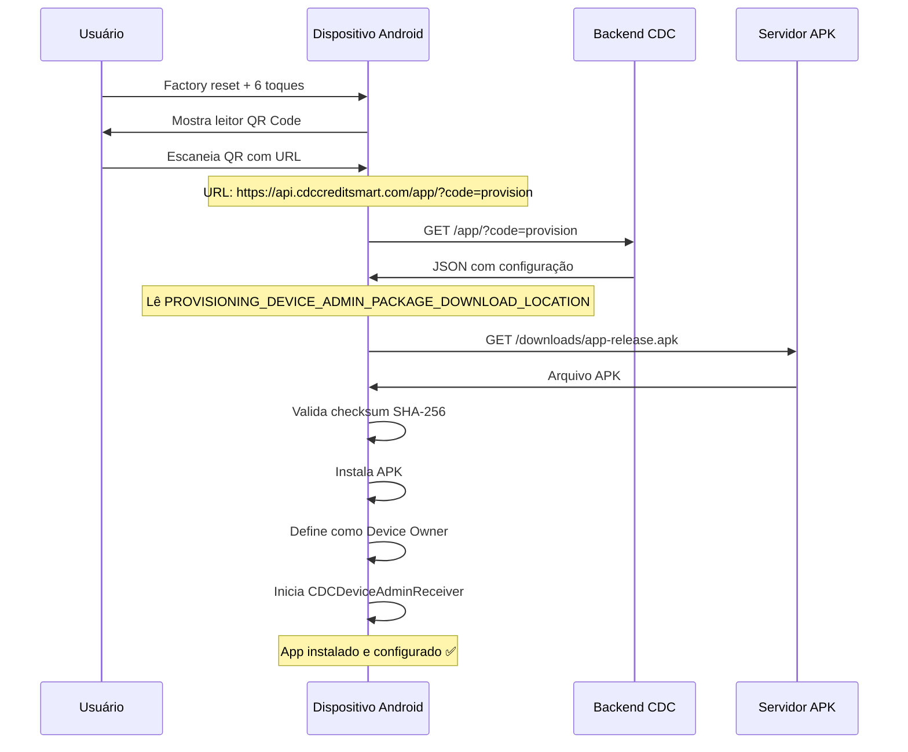

# 🔗 Integração Backend - QR Code Provisioning

## ✅ Rota Específica do Backend

O backend CDC Credit Smart **JÁ possui** um endpoint dedicado para QR Code provisioning:

```
https://api.cdccreditsmart.com/app/?code=provision
```

---

## 📋 Como o Backend Deve Responder

### **Opção 1: Retornar JSON de Provisioning (Recomendado)**

O Android permite que a URL do QR Code retorne um JSON com as configurações:

**Request:**
```http
GET /app/?code=provision HTTP/1.1
Host: api.cdccreditsmart.com
```

**Response:**
```http
HTTP/1.1 200 OK
Content-Type: application/json

{
  "android.app.extra.PROVISIONING_DEVICE_ADMIN_COMPONENT_NAME": "com.cdccreditsmart.app/com.cdccreditsmart.device.CDCDeviceAdminReceiver",
  "android.app.extra.PROVISIONING_DEVICE_ADMIN_PACKAGE_DOWNLOAD_LOCATION": "https://api.cdccreditsmart.com/downloads/app-release.apk",
  "android.app.extra.PROVISIONING_DEVICE_ADMIN_PACKAGE_CHECKSUM": "base64url_encoded_sha256",
  "android.app.extra.PROVISIONING_SKIP_ENCRYPTION": true,
  "android.app.extra.PROVISIONING_LEAVE_ALL_SYSTEM_APPS_ENABLED": true,
  "android.app.extra.PROVISIONING_ADMIN_EXTRAS_BUNDLE": {
    "contract_code": "DYNAMIC_FROM_BACKEND",
    "server_url": "https://api.cdccreditsmart.com",
    "auto_start_pairing": true
  }
}
```

### **Opção 2: Redirect para APK Direto**

Se o backend preferir, pode fazer redirect direto para o APK:

```http
HTTP/1.1 302 Found
Location: https://api.cdccreditsmart.com/downloads/app-release.apk
```

⚠️ **Problema:** Não permite passar configurações extras (contract_code, etc.)

---

## 🎯 Arquitetura Recomendada

### **Endpoint 1: JSON de Provisioning**
```
GET /app/?code=provision
→ Retorna JSON com configuração completa
```

### **Endpoint 2: Download do APK**
```
GET /downloads/app-release.apk
→ Retorna o arquivo APK
→ Content-Type: application/vnd.android.package-archive
```

### **Endpoint 3: Checksum (Opcional)**
```
GET /downloads/app-release.apk.sha256
→ Retorna apenas o checksum base64url
```

---

## 📱 Fluxo Completo do QR Code



---

## 🔧 Exemplo de Implementação Backend

### **Node.js/Express:**

```javascript
app.get('/app/', async (req, res) => {
  const { code } = req.query;
  
  if (code === 'provision') {
    // Buscar checksum do APK atual
    const checksum = await getLatestApkChecksum();
    
    res.json({
      "android.app.extra.PROVISIONING_DEVICE_ADMIN_COMPONENT_NAME": 
        "com.cdccreditsmart.app/com.cdccreditsmart.device.CDCDeviceAdminReceiver",
      
      "android.app.extra.PROVISIONING_DEVICE_ADMIN_PACKAGE_DOWNLOAD_LOCATION": 
        "https://api.cdccreditsmart.com/downloads/app-release.apk",
      
      "android.app.extra.PROVISIONING_DEVICE_ADMIN_PACKAGE_CHECKSUM": 
        checksum,
      
      "android.app.extra.PROVISIONING_SKIP_ENCRYPTION": true,
      "android.app.extra.PROVISIONING_LEAVE_ALL_SYSTEM_APPS_ENABLED": true,
      
      "android.app.extra.PROVISIONING_ADMIN_EXTRAS_BUNDLE": {
        "server_url": "https://api.cdccreditsmart.com",
        "auto_start_pairing": true,
        "environment": "production"
      }
    });
  } else {
    res.status(400).json({ error: "Invalid provisioning code" });
  }
});

// Endpoint para download do APK
app.get('/downloads/app-release.apk', (req, res) => {
  const apkPath = path.join(__dirname, 'apk', 'app-release.apk');
  
  res.setHeader('Content-Type', 'application/vnd.android.package-archive');
  res.setHeader('Content-Disposition', 'attachment; filename="app-release.apk"');
  res.setHeader('Cache-Control', 'public, max-age=3600');
  
  res.sendFile(apkPath);
});
```

### **Python/Flask:**

```python
from flask import Flask, jsonify, send_file
import hashlib
import base64

app = Flask(__name__)

@app.route('/app/')
def provision():
    code = request.args.get('code')
    
    if code == 'provision':
        checksum = get_apk_checksum()
        
        return jsonify({
            "android.app.extra.PROVISIONING_DEVICE_ADMIN_COMPONENT_NAME": 
                "com.cdccreditsmart.app/com.cdccreditsmart.device.CDCDeviceAdminReceiver",
            
            "android.app.extra.PROVISIONING_DEVICE_ADMIN_PACKAGE_DOWNLOAD_LOCATION": 
                "https://api.cdccreditsmart.com/downloads/app-release.apk",
            
            "android.app.extra.PROVISIONING_DEVICE_ADMIN_PACKAGE_CHECKSUM": 
                checksum,
            
            "android.app.extra.PROVISIONING_SKIP_ENCRYPTION": True,
            "android.app.extra.PROVISIONING_LEAVE_ALL_SYSTEM_APPS_ENABLED": True,
            
            "android.app.extra.PROVISIONING_ADMIN_EXTRAS_BUNDLE": {
                "server_url": "https://api.cdccreditsmart.com",
                "auto_start_pairing": True,
                "environment": "production"
            }
        })
    
    return jsonify({"error": "Invalid code"}), 400

@app.route('/downloads/app-release.apk')
def download_apk():
    return send_file(
        'apk/app-release.apk',
        mimetype='application/vnd.android.package-archive',
        as_attachment=True,
        download_name='app-release.apk'
    )

def get_apk_checksum():
    """Calcula SHA-256 base64url do APK"""
    with open('apk/app-release.apk', 'rb') as f:
        sha256 = hashlib.sha256(f.read()).digest()
        b64 = base64.b64encode(sha256).decode()
        # Converter para base64url
        b64url = b64.replace('+', '-').replace('/', '_').replace('=', '')
        return b64url
```

---

## 🔑 Cálculo do Checksum

```bash
# Linux/macOS:
cat app-release.apk | openssl dgst -binary -sha256 | openssl base64 | tr '+/' '-_' | tr -d '='

# Python:
import hashlib, base64
with open('app-release.apk', 'rb') as f:
    sha256 = hashlib.sha256(f.read()).digest()
    b64 = base64.b64encode(sha256).decode()
    checksum = b64.replace('+', '-').replace('/', '_').replace('=', '')
    print(checksum)
```

---

## 📦 QR Code Final

O QR Code deve conter apenas a URL:

```
https://api.cdccreditsmart.com/app/?code=provision
```

**NÃO** precisa do JSON completo no QR Code, apenas a URL!

---

## ✅ Checklist Backend

```
□ Endpoint /app/?code=provision retorna JSON correto
□ Endpoint /downloads/app-release.apk serve o APK
□ Checksum está sendo calculado corretamente
□ HTTPS configurado corretamente
□ CORS não está bloqueando (se necessário)
□ Content-Type correto: application/json e application/vnd.android.package-archive
□ Logs de acesso para debug
```

---

**Data:** 20 de Novembro de 2025  
**Status:** Pronto para integração backend
