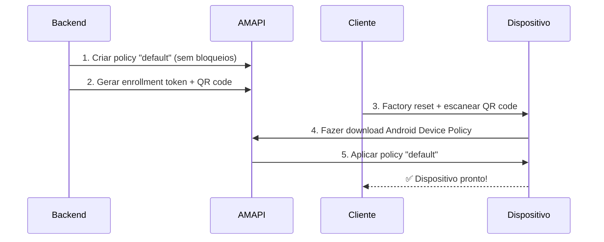
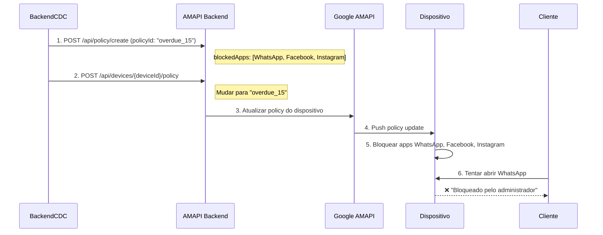
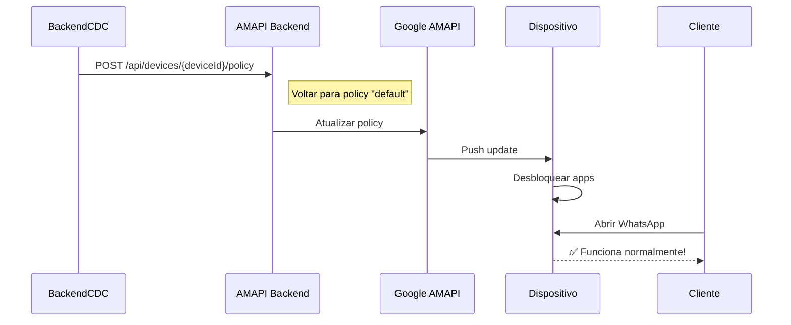

# 🚀 Android Management API Backend - CDC Credit Smart

Backend Node.js para gerenciar dispositivos Android via **Android Management API** (AMAPI). Substitui o DPC customizado pelo **Android Device Policy** do Google, eliminando bloqueios do Play Protect durante provisioning via QR Code.

---

## 🎯 Por que usar Android Management API?

### **Problema Resolvido:**
- ❌ **ANTES:** DPC customizado com `BIND_ACCESSIBILITY_SERVICE` → Play Protect bloqueia instalação
- ✅ **AGORA:** Android Device Policy (Google DPC) → Zero bloqueios do Play Protect

### **Vantagens:**
1. ✅ **Play Protect Aprovado** - Instalação suave via QR Code
2. ✅ **Grátis até 10.000 dispositivos** - Sem custos de licenciamento
3. ✅ **Controle total via API** - Bloqueio de apps, policies, comandos remotos
4. ✅ **Future-proof** - Solução oficial Google, atualizada automaticamente
5. ✅ **Sem Developer Verification** - Economiza $25 USD em setembro/2026

---

## 📋 Pré-requisitos

1. **Google Cloud Project** criado
2. **Android Management API** habilitada
3. **Service Account** criada com role `Android Management User`
4. **Chave JSON** do service account (já fornecida)

---

## 🛠️ Setup

### **1. Instalar Dependências**

```bash
cd backend-amapi
npm install
```

### **2. Configurar Variáveis de Ambiente**

Copie o arquivo de exemplo:
```bash
cp .env.example .env
```

Edite `.env` e adicione a chave JSON completa:
```bash
GOOGLE_SERVICE_ACCOUNT_JSON='{"type":"service_account","project_id":"silicon-reason-452201-d7",...}'
PORT=3001
```

**⚠️ IMPORTANTE:** Nunca commite o arquivo `.env` ou a chave JSON!

### **3. Iniciar Servidor**

```bash
npm start
```

Ou em modo desenvolvimento (auto-reload):
```bash
npm run dev
```

---

## 🚀 Primeira Execução - Criar Enterprise

### **Passo 1: Gerar URL de Signup**

Acesse no navegador:
```
http://localhost:3001/api/enterprise/signup-url
```

Você receberá:
```json
{
  "success": true,
  "signupUrl": "https://enterprise.google.com/android/enroll?..."
}
```

### **Passo 2: Acessar URL e Fazer Login**

1. Abra a `signupUrl` no navegador
2. Faça login com uma conta Gmail (@gmail.com ou G Suite)
3. Aceite os termos de serviço
4. Você será redirecionado para o callback

### **Passo 3: Copiar Enterprise ID**

Após o callback, você verá:
```
✅ Enterprise Criado com Sucesso!

Enterprise ID:
enterprises/LC...

Adicione ao .env:
ENTERPRISE_ID=enterprises/LC...
```

### **Passo 4: Configurar .env**

Adicione ao arquivo `.env`:
```bash
ENTERPRISE_ID=enterprises/LC...
```

### **Passo 5: Reiniciar Servidor**

```bash
npm start
```

Agora você está pronto para criar policies e gerar QR codes! 🎉

---

## 📡 Endpoints da API

### **🏢 Enterprise**

#### **GET /api/enterprise/signup-url**
Gera URL para criar enterprise (primeira vez)

**Resposta:**
```json
{
  "success": true,
  "signupUrl": "https://enterprise.google.com/android/enroll?..."
}
```

#### **GET /api/enterprise/info**
Retorna informações do enterprise

**Resposta:**
```json
{
  "success": true,
  "enterprise": {
    "name": "enterprises/LC...",
    "enabledNotificationTypes": [...],
    ...
  }
}
```

---

### **📜 Policies**

#### **POST /api/policy/create**
Cria/atualiza policy para bloquear apps

**Body:**
```json
{
  "policyId": "overdue_level_3",
  "blockedApps": [
    "com.whatsapp",
    "com.facebook.katana",
    "com.instagram.android"
  ],
  "forceInstalledApps": [
    "com.cdccreditsmart.app"
  ]
}
```

**Resposta:**
```json
{
  "success": true,
  "policy": { ... },
  "policyName": "enterprises/LC.../policies/overdue_level_3"
}
```

**Exemplo de uso:**

```bash
curl -X POST http://localhost:3001/api/policy/create \
  -H "Content-Type: application/json" \
  -d '{
    "policyId": "overdue_3",
    "blockedApps": ["com.whatsapp", "com.facebook.katana"]
  }'
```

#### **GET /api/policy/list**
Lista todas as policies criadas

---

### **📱 Enrollment & QR Code**

#### **POST /api/enrollment/create-token**
Gera enrollment token e QR code para provisioning

**Body:**
```json
{
  "policyId": "default",
  "deviceType": "COMPANY_OWNED"
}
```

**Resposta:**
```json
{
  "success": true,
  "token": "123abc...",
  "qrCode": "{\"android.app.extra...}",
  "qrCodeImage": "data:image/png;base64,...",
  "expirationTimestamp": "2025-11-22T12:00:00Z",
  "policyName": "enterprises/LC.../policies/default"
}
```

**`qrCodeImage`**: Data URL da imagem do QR Code pronta para usar!

**Exemplo de uso:**

```bash
curl -X POST http://localhost:3001/api/enrollment/create-token \
  -H "Content-Type: application/json" \
  -d '{
    "policyId": "default",
    "deviceType": "COMPANY_OWNED"
  }' > qr-response.json
```

---

### **📲 Devices**

#### **GET /api/devices/list**
Lista todos os dispositivos gerenciados

**Resposta:**
```json
{
  "success": true,
  "devices": [
    {
      "name": "enterprises/LC.../devices/123",
      "policyName": "enterprises/LC.../policies/default",
      "enrollmentTime": "2025-11-21T10:00:00Z",
      ...
    }
  ],
  "count": 5
}
```

#### **POST /api/devices/:deviceId/policy**
Atualiza policy de um dispositivo específico

**Body:**
```json
{
  "policyId": "overdue_level_3"
}
```

**Exemplo - Bloquear apps quando cliente fica inadimplente:**

```bash
# Cliente com 15 dias de atraso → aplicar policy agressiva
curl -X POST http://localhost:3001/api/devices/ABC123/policy \
  -H "Content-Type: application/json" \
  -d '{"policyId": "overdue_level_3"}'
```

#### **POST /api/devices/:deviceId/command**
Envia comando para dispositivo

**Body:**
```json
{
  "type": "REBOOT"
}
```

**Comandos disponíveis:**
- `REBOOT` - Reinicia o dispositivo
- `LOCK` - Bloqueia a tela
- `RESET_PASSWORD` - Reseta senha

---

## 🎯 Fluxo Completo de Uso

### **Cenário: Cliente financia dispositivo**



### **Cenário: Cliente fica inadimplente (15 dias)**



### **Cenário: Cliente paga parcela**



---

## 🔗 Integração com Backend CDC

### **Endpoint recomendado no backend CDC:**

```javascript
/**
 * POST /api/mdm/update-device-policy
 * Atualiza policy de dispositivo baseado em status de pagamento
 */
router.post('/api/mdm/update-device-policy', async (req, res) => {
  const { deviceId, daysOverdue } = req.body;
  
  // Determinar policy baseado em atraso
  let policyId = 'default';
  if (daysOverdue >= 30) {
    policyId = 'overdue_30';
  } else if (daysOverdue >= 15) {
    policyId = 'overdue_15';
  } else if (daysOverdue >= 5) {
    policyId = 'overdue_5';
  }
  
  // Chamar Android Management API Backend
  const response = await axios.post(
    `http://localhost:3001/api/devices/${deviceId}/policy`,
    { policyId: policyId }
  );
  
  res.json(response.data);
});
```

---

## 📊 Monitoramento

### **GET /health**
Health check do servidor

**Resposta:**
```json
{
  "status": "online",
  "service": "Credit Smart - Android Management API Backend",
  "authenticated": true,
  "enterpriseConfigured": true
}
```

---

## 🎨 Personalização de Policies

### **Exemplo: Policy Progressiva (5 dias)**

```json
{
  "policyId": "overdue_5",
  "blockedApps": [
    "com.whatsapp",
    "com.facebook.katana"
  ],
  "forceInstalledApps": [
    "com.cdccreditsmart.app"
  ]
}
```

### **Exemplo: Policy Agressiva (15+ dias)**

```json
{
  "policyId": "overdue_15",
  "blockedApps": [
    "com.whatsapp",
    "com.facebook.katana",
    "com.instagram.android",
    "com.twitter.android",
    "com.google.android.youtube",
    "com.netflix.mediaclient"
  ],
  "forceInstalledApps": [
    "com.cdccreditsmart.app"
  ]
}
```

---

## 🔐 Segurança

### **Proteção da Chave JSON:**

1. ✅ Nunca commitar `.env` ou arquivos `.json`
2. ✅ Adicionar ao `.gitignore`
3. ✅ Usar Replit Secrets em produção
4. ✅ Rotar chaves periodicamente (a cada 90 dias)

### **Permissões Mínimas:**

A service account precisa apenas do role:
- `roles/androidmanagement.user`

---

## 🐛 Troubleshooting

### **Erro: "Unauthorized"**

**Causa:** Chave JSON inválida ou service account sem permissões

**Solução:**
1. Verifique se `GOOGLE_SERVICE_ACCOUNT_JSON` está correto
2. Confirme que service account tem role `Android Management User`
3. Verifique se Android Management API está habilitada no projeto

---

### **Erro: "Enterprise not found"**

**Causa:** `ENTERPRISE_ID` não configurado ou inválido

**Solução:**
1. Acesse `/api/enterprise/signup-url`
2. Complete o signup
3. Adicione `ENTERPRISE_ID` ao `.env`
4. Reinicie o servidor

---

### **QR Code não funciona**

**Causa:** Dispositivo não compatível ou QR Code expirado

**Solução:**
1. Verifique se dispositivo é Android 7.0+ e factory reset
2. Gere novo enrollment token (expiram em 24h)
3. Use WiFi estável durante provisioning

---

## 📚 Recursos

- **Documentação oficial:** https://developers.google.com/android/management
- **API Reference:** https://developers.google.com/android/management/reference/rest
- **Quickstart:** https://github.com/google/android-management-api-samples
- **QR Code Generator:** https://bayton.org/qr-generator/

---

## 🎯 Próximos Passos

1. ✅ Criar enterprise (primeira vez)
2. ✅ Criar policies de bloqueio (overdue_5, overdue_15, overdue_30)
3. ✅ Gerar QR code para provisioning
4. ✅ Testar em Infinix Hot 50
5. ✅ Integrar com backend CDC
6. 🚀 Deploy em produção!

---

**Desenvolvido com ❤️ para CDC Credit Smart**
