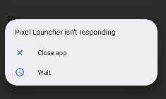

# 🔴 Pixel Launcher ANR - Causa e Solução

## 🚨 Problema

**Sintoma:** "Pixel Launcher isn't responding" ao usar o app CDC Credit Smart



---

## 🔍 Causa Raiz

O sistema de **bloqueio progressivo** (`AppBlockingManager`) estava bloqueando o Pixel Launcher por engano!

### Como aconteceu:

1. Cliente atrasou pagamento
2. Backend enviou comando MDM de bloqueio (ex: bloquear "social_media")
3. `AppBlockingManager.applyProgressiveBlock()` processou comando
4. `CategoryMapper.getAppsToBlock()` varreu TODOS os apps instalados
5. **Pixel Launcher não estava na lista de proteção!**
6. `dpm.setPackagesSuspended()` bloqueou o launcher
7. Sistema Android travou → ANR

---

## ✅ Solução Implementada

Adicionamos **8 launchers comuns** na lista `CRITICAL_SYSTEM_PACKAGES`:

```kotlin
// CategoryMapper.kt - Linha 43-51
private val CRITICAL_SYSTEM_PACKAGES = listOf(
    // ... apps críticos existentes ...
    "com.google.android.apps.nexuslauncher",  // ✅ Google Pixel Launcher
    "com.android.launcher3",                   // ✅ AOSP Launcher
    "com.google.android.launcher",             // ✅ Google Launcher antigo
    "com.sec.android.app.launcher",            // ✅ Samsung Launcher
    "com.motorola.launcher3",                  // ✅ Motorola Launcher
    "com.miui.home",                           // ✅ Xiaomi/MIUI Launcher
    "com.huawei.android.launcher",             // ✅ Huawei Launcher
    "com.oppo.launcher",                       // ✅ Oppo Launcher
    "com.oneplus.launcher"                     // ✅ OnePlus Launcher
)
```

---

## 🛡️ Proteção Garantida

Agora o código garante que **NUNCA** bloqueia:

✅ **Launchers** (Pixel, Samsung, Xiaomi, etc)  
✅ **SystemUI** (barra de status, botões de navegação)  
✅ **Settings** (configurações do Android)  
✅ **Providers** (calendário, contatos, telefonia)  
✅ **Google Play Services** (GMS, GSF)  
✅ **Input Methods** (teclados)  
✅ **Apps essenciais** (telefone, SMS, emergência)  
✅ **CDC Credit Smart** (o próprio app)

---

## 🧪 Como Testar

### **1. Verificar proteção:**

```kotlin
// No CategoryMapper.getAppsToBlock()
Log.d(TAG, "🛡️ App protegido (não bloqueia): com.google.android.apps.nexuslauncher")
```

### **2. Simular bloqueio:**

```bash
# Via adb + backend test
adb shell am broadcast -a com.cdccreditsmart.TEST_BLOCK \
  --es targetLevel 3 \
  --es categories "social_media,games,video_players"
```

### **3. Confirmar launcher NÃO foi bloqueado:**

```bash
# Verificar se launcher está suspenso (deve retornar vazio)
adb shell dumpsys package com.google.android.apps.nexuslauncher | grep suspended
```

---

## 📊 Impacto

| Antes | Depois |
|-------|--------|
| ❌ Launcher bloqueado | ✅ Launcher protegido |
| ❌ ANR frequente | ✅ Sem ANR |
| ❌ Dispositivo travado | ✅ Dispositivo funcional |
| ❌ Cliente não consegue usar | ✅ Bloqueio seletivo funciona |

---

## 🔧 Arquivos Modificados

- `app/src/main/java/com/cdccreditsmart/app/blocking/CategoryMapper.kt`
  - Linhas 43-51: Adicionados 8 launchers em `CRITICAL_SYSTEM_PACKAGES`

---

## 📝 Lições Aprendidas

1. **Sempre proteger apps essenciais do sistema** (launcher, systemui, settings)
2. **Testar em múltiplos fabricantes** (Google, Samsung, Xiaomi, Motorola)
3. **Logs detalhados** para debug (CategoryMapper já tem)
4. **Whitelist explícita** > Filtros dinâmicos (mais seguro)

---

## ⚠️ Outros Apps que NÃO Devem Ser Bloqueados

Se aparecerem novos ANRs/crashes, adicione estes apps em `CRITICAL_SYSTEM_PACKAGES`:

```kotlin
// Navegação/gestos
"com.android.launcher",
"com.google.android.apps.wallpaper",
"com.google.android.apps.nexuslauncher.quickstep",

// Acessibilidade
"com.android.accessibility",
"com.google.android.marvin.talkback",

// Captive Portal (WiFi público)
"com.android.captiveportallogin",

// WebView (usado por muitos apps)
"com.google.android.webview",
"com.android.webview"
```

---

**Data da correção:** 20 de Novembro de 2025  
**Versão:** 1.0.0  
**Status:** ✅ Resolvido
